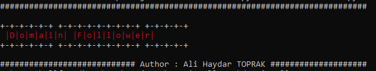
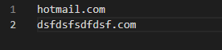
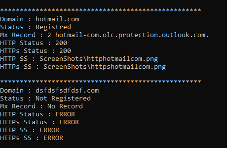

# Domain Follower

### Description

DomainFollower is a code script that keeps track of domain registrations.

### Abilities

- Domain Registration Check
- Domain MX Record Check
- HTTTP or HTTPs Check
- If there is a web application, take a screenshot

### Requirements

- python3
- pip
- webDriver for Chrome (https://chromedriver.chromium.org/downloads)

### How to Works ?

- Clone or Download Repo
- Run __pip install -r requirements.txt__ or __pip3 install -r requirements.txt__
- Add domains or subdomains to __sources.txt__
- Run "domainFollower.py" (__python domainFollower.py__) or (__python3 domainFollower.py__)

### Example Results

